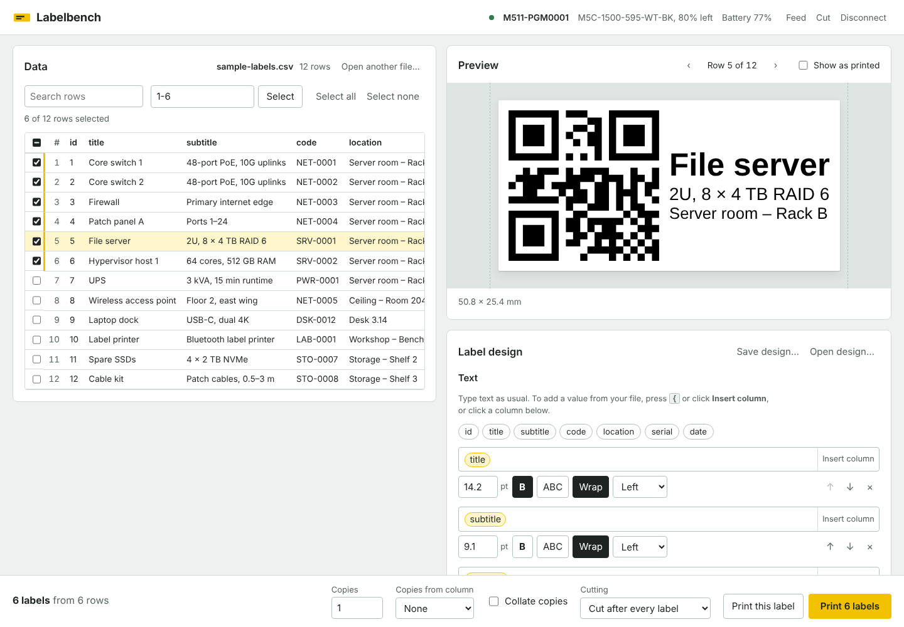

# Labelbench

Batch-print labels from a CSV or Excel file to a Brady Bluetooth label printer. Asset tags, cable labels, shelf and bin labels, inventory: design the label once, pick the rows, print hundreds.

Labelbench runs entirely on your own computer, on Windows, macOS and Linux, and needs no internet connection or account.



- Open a CSV, TSV or Excel (.xlsx) file, then choose which rows to print by ticking them, searching, or typing a range such as `1-20, 25`.
- Design the label: lines of text built from your columns and your own text, with size, bold, capitals and alignment, plus an optional QR code, Data Matrix or barcode.
- See the exact label for any row before printing, including the black-and-white bitmap the printer will receive.
- Print in batches, with copies per row (fixed or taken from a column) and cutting options. If the printer runs out of tape, fix it and continue from where it stopped.
- Every label is checked before printing, so text that doesn't fit is caught before any tape is used.

## Printers

Labelbench is tested with the **Brady M511**.

It uses Brady's official Web SDK, which also recognises the M211, M610, M611, M710, M811J, S3700, i3311, i4311, i5311 and i7500. Label size and resolution are read from the printer, so other models that connect over **Bluetooth Low Energy** may well work. Models that only connect by USB or Wi-Fi won't. If you try another model, please [open an issue](https://github.com/Rieck-tech/labelbench/issues) and say how it went.

## Install

Download the latest version for your system from the [Releases page](https://github.com/Rieck-tech/labelbench/releases):

| System | File |
| --- | --- |
| Windows | `Labelbench-…-win-x64.exe` |
| macOS | `Labelbench-…-mac-arm64.dmg` (Apple silicon) or `-x64.dmg` (Intel) |
| Linux | `Labelbench-…-linux-x86_64.AppImage`, or the `.deb` |

The builds aren't signed by a registered Apple or Microsoft developer yet, so the first launch needs one extra step.

**macOS**

1. Open the `.dmg` and drag **Labelbench** to **Applications**.
2. Open Labelbench. macOS says *"Labelbench.app" Not Opened* because Apple couldn't check it. Click **Done** (not Move to Bin).
3. Open **System Settings → Privacy & Security**, scroll down to **Security**, and click **Open Anyway** next to the line about Labelbench. Confirm with your password or Touch ID.
4. Open Labelbench again and click **Open**. From now on it opens normally.
5. The first time you connect a printer, allow Labelbench to use Bluetooth.

If macOS instead says the app *"is damaged and can't be opened"*, it isn't broken; macOS says this about some downloaded apps. Run this in Terminal, then open it again:

```sh
xattr -cr /Applications/Labelbench.app
```

**Windows**: if SmartScreen says it protected your PC, click **More info**, then **Run anyway**.

**Linux**: make the AppImage executable (`chmod +x Labelbench-*.AppImage`). Bluetooth needs BlueZ, which most desktop distributions include.

Bluetooth must be turned on in your computer's settings.

## Print your first labels

1. Turn on the printer and click **Connect printer**, then pick it from the list. It can take up to a minute for the printer to show up, so give it time before trying again.
2. Drop your file onto the **Data** panel, or click **Choose file…**. The first row must hold the column names. To look around first, click **Try the sample data**.
3. Click **Use cartridge size** to match the loaded labels, or type a size. Labelbench uses the cartridge's *printable area*: for self-laminating labels, that's only the white part. If the design and the cartridge don't match, Labelbench says so, because the printer would otherwise scale every label to fit.
4. Build the label: type text, and press <kbd>{</kbd> to insert a value from a column.
5. Click **Print this label** to print one test label. If it comes out sideways or upside down, change **Turn when printing**. If thin text is faint, increase **Darkness**.
6. Select the rows and click **Print _n_ labels**.

**Save design…** stores a label design as a file, and **Open design…** loads it again. The current design is also remembered between sessions.

## Label text

Each text line is typed like ordinary text. Values from your file appear in it as small pills:

- Press <kbd>{</kbd> or click **Insert column**, start typing the column's name, and press Enter (or click it).
- Or click a column name above the lines to insert it where you last typed.
- Backspace removes a pill in one go.

For example, the line **Asset** `code` **·** `location`, for a row where code is SRV-0001 and location is Rack B, prints *Asset SRV-0001 · Rack B*.

Each line has its own size, **B** (bold), **ABC** (capitals), **Wrap** and alignment. Long text is shrunk to fit; with **Wrap** on, it can continue onto a second line. If it still doesn't fit, it's cut short with "…" and you're warned before printing.

## Files

- **CSV / TSV**: comma, semicolon (common in European versions of Excel) or tab separated. UTF-8, or Windows-1252 as saved by older versions of Excel, so accented letters come through.
- **Excel (.xlsx)**: the first sheet with data. Dates are shown as `YYYY-MM-DD`, formulas as their result.
- Old **.xls** files aren't supported; save them as .xlsx or CSV first.

## Privacy

Everything happens on your computer. Your files are never uploaded, and Labelbench turns off the analytics in Brady's SDK.

## Run in a browser instead

Labelbench is also a plain web app that you can run from source, in **Google Chrome** or **Microsoft Edge** (Safari and Firefox can't use Bluetooth from a web page). You need [Node.js](https://nodejs.org) 18 or newer.

```sh
git clone https://github.com/Rieck-tech/labelbench.git
cd labelbench
npm install
npm start
```

`npm install` needs internet once. `npm start` serves the app at <http://localhost:5511> and opens your browser. Keep the terminal open while printing, and press Ctrl+C to stop.

## Development

```sh
npm test          # tests (Vitest)
npm run test:watch
npm run app       # the desktop app, from source
npm run pack      # build the desktop app into dist/ without an installer (named and iconed like a release)
npm run dist      # build an installer for this system into dist/
```

There is no build step for the web app. The page loads plain ES modules from `src/`, with an import map pointing at the libraries in `node_modules`. `server.mjs` is a dependency-free static server that only serves the app's own files, on localhost only. The desktop app runs the same server inside Electron, so Web Bluetooth gets the secure page it requires.

```
index.html                 the page and import map
server.mjs                 local web server
src/app.js                 user interface and printing flow
src/printer.js             wrapper around Brady's SDK
src/part-editor.js         the text editor with column pills
src/render.js              text measuring, barcodes, SVG to printer bitmap
src/lib/                   plain logic, covered by tests
electron/main.js           desktop app: window, server, Bluetooth handling
electron/bluetooth-chooser.js, picker.html
                           the printer picker (Electron has no built-in one)
examples/                  sample data
build/icon.svg             app icon source; build/icon.png (1024 px) and electron/icon.png (512 px) are made from it
tests/                     Vitest tests
```

### Releasing

Push a version tag (for example `git tag v0.2.0 && git push origin v0.2.0`, after updating `version` in `package.json`). GitHub Actions runs the tests, builds the Windows, macOS and Linux installers, and attaches them to a draft release for you to review and publish.

## Known limits

- Tested on the M511 only; batch speed over Bluetooth depends on the printer and computer.
- Labels use the system's Helvetica or Arial, since custom fonts can't be embedded offline in the same way.
- For continuous tape, the label length is whatever you set; the printer only reports the tape width.

## Brady's SDK and licences

Talking to the printer uses Brady's official [Web SDK](https://sdk.bradyid.com/), which is proprietary and not part of this repository. Running from source, `npm install` downloads it from npm. The desktop builds include it unmodified as part of the application, under [Brady's licence](https://www.npmjs.com/package/@bradycorporation/brady-web-sdk), which ships with the app.

Labelbench's own code is MIT licensed (see `LICENSE`). Third-party components and their licences are listed in [THIRD_PARTY_NOTICES.md](THIRD_PARTY_NOTICES.md).

Labelbench is an independent project, not affiliated with or endorsed by Brady Corporation. Brady and the printer model names are trademarks of Brady Worldwide, Inc.
